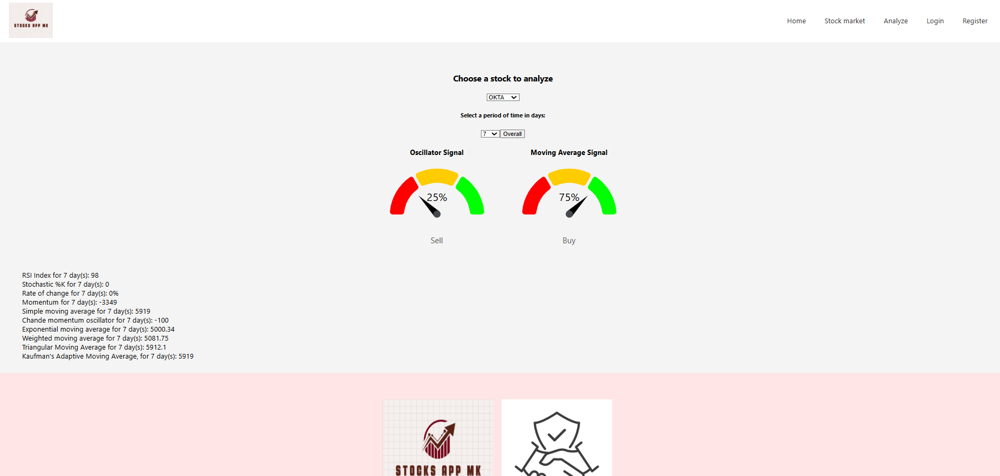

# Stocks-Project
<h2>Design and architecture of software project</h2>
<p>This project which contains 4 parts is a continious work on the same application designed to showcase each step from scratch of building an early application, which in this case is a stocks application.</p>
<p>
  </br>
  Document for the explanation for the usage of the chosen <a href="./Domasna 4/Design Pattern.pdf" target="_blank">design</a> pattern.
</p>
<p><b>Steps:</b></p>
<ol>
  <li> <h2><a href="./Домашна 1/OpisBaranjaProekt.pdf">Writing the requirements and user stories</a></h2>
    <ul>
    <li>
      <h3>
      Webscraping the needed stocks for further continuation of the development
      </h3>
    </li>
      </ul>
  </li>
  <li><h2>Building a mockup, tech prototype and an overall architecture design of the system and the technologies that will be used</h2>
    <h3>Figma mockup:</h3>
    
    <h3>Architecture design:</h3>
    
  </li>
  <li>
    <h2>A working application in its first release</h2>
    <h3>Application example:</h3>
    
  </li>
  <li>
    <h2>
    Refactoring of the code using design patterns, improving the structure of the code, dockerization and containerization of the application.
      </h2>
    <h3>Refactored code examples</h3>

  ```java

    /**
     *
     * @param symbol the stock for which we are going to calculate
     * @param period the period for which we are going to calculate
     * @param indicator the technical oscillator or moving average we calculate
     * @return the index value for that indicator
     */
    @GetMapping("/indicator")
    public ResponseEntity<BigDecimal> getIndicator(
            @RequestParam String symbol,
            @RequestParam int period,
            @RequestParam String indicator
    ){
        List<StockData> listData = stockService.getByStockSymbol(symbol);
        List<BigDecimal> prices = stockService.getLastTransactionPrices(listData);

        Collections.reverse(prices);
        BigDecimal index = BigDecimal.valueOf(0);
        index = switch (indicator) {
            case "rsi" -> stockAnalysisService.calculateRSI(prices, period);
            case "stochastic" -> stockAnalysisService.calculateStochasticK(prices, period);
            case "roc" -> stockAnalysisService.calculateROC(prices, period);
            case "momentum" -> stockAnalysisService.calculateMomentum(prices, period);
            case "sma" -> stockAnalysisService.calculateSMAOscillator(prices, period);
            case "cmo" -> stockAnalysisService.calculateCMO(prices, period);
            case "ema" -> stockAnalysisService.calculateEMA(prices, period);
            case "wma" -> stockAnalysisService.calculateWMA(prices, period);
            case "tma" -> stockAnalysisService.calculateTMA(prices, period);
            case "kama" -> stockAnalysisService.calculateKAMA(prices, period);
            default -> index;
        };

        return new ResponseEntity<>(index,HttpStatus.OK);
    }


```


  <h3>Service interface example:</h3>


```java
/**
 * This service allows us to perform non-analysis actions on the stocks, such as filtering, getting symbols
 * or simple retrieval of stock data
 */
public interface StockService {
    /**
     * Retrieves all stock data from the repository.
     *
     * @return a list of all StockData.
     */
    List<StockData> getAllStockData();
    /**
     * Retrieves stock data based on the provided filters.
     * @param symbol the stock symbol to filter by.
     * @param avgPrice the average price to filter by.
     * @param fromDate the start date of the range to filter by.
     * @param toDate the end date of the range to filter by.
     * @return a list of StockData that matches the filters.
     */
    List<StockData> getFilteredStockData(String symbol, BigDecimal avgPrice, String fromDate, String toDate);
    /**
     * Retrieves all stock data for a specific stock symbol.
     *
     * @param symbol the stock symbol to filter by.
     * @return a list of StockData for the given symbol.
     */
    List<StockData> getByStockSymbol(String symbol);
    /**
     * Retrieves a list of distinct stock symbols from the repository.
     *
     * @return a list of distinct stock symbols.
     */
    List<String> findDistinctStockSymbols();
    /**
     * Extracts the last transaction prices from a list of StockData objects.
     *
     * @param stockDataList the list of StockData to extract prices from.
     * @return a list of BigDecimal values representing the last transaction prices.
     */
    List<BigDecimal> getLastTransactionPrices(List<StockData> stockDataList);
    /**
     * Calculates the average price for each year from a list of StockData objects.
     *
     * @param listData the list of StockData to process.
     * @return a map where the key is the year and the value is the average price for that year.
     */
    Map<String, Double> getYearAverage(List<StockData> listData);


}
```

<h3>Docker-compose:</h3>

```yaml

version: '3'
services:
  eureka-server:
    build:
      context: ./EurekaServer
    ports:
      - "8761:8761"
    networks:

      - custom_network

  user-service:
    build:
      context: ./UserMicroservice
    ports:
      - "8081:8081"
    networks:
      - custom_network
    depends_on:
      - eureka-server

  csv-microservice:
    build:
      context: ./CsvMicroservice
    ports:
      - "8082:8082"
    networks:
      - custom_network
    depends_on:
      - eureka-server

  stocks-app:
    build:
      context: ./StocksApp
    ports:
      - "8080:8080"
    networks:
      - custom_network
    depends_on:
      - eureka-server
      - user-service
      - db

  frontend:
    build:
      context: ./stock_front
    ports:
      - "3000:3000"
    networks:
      - custom_network
    environment:
      - PORT=3000
    depends_on:
      - stocks-app

  db:
    image: postgres:17
    container_name: postgres_db
    restart: always
    ports:
      - "5432:5432"
    environment:
      POSTGRES_USER: postgres
      POSTGRES_PASSWORD: password
      POSTGRES_DB: stock_data
    volumes:
      - postgres_data:/var/lib/postgresql/data
      - ./init-scripts:/docker-entrypoint-initdb.d
    healthcheck:
      test: [ "CMD", "pg_isready", "-U", "postgres" ]
      interval: 30s
      retries: 5
      timeout: 10s
    networks:
      - custom_network


networks:
  custom_network:
    driver: bridge

volumes:
  postgres_data:

```
  </li>
</ol>

<p>
  Ivan Trajkov 221267
  <br>
  Dushan Tashev 221099
  <br>
  Kristijan Simonovski 221244
</p>

